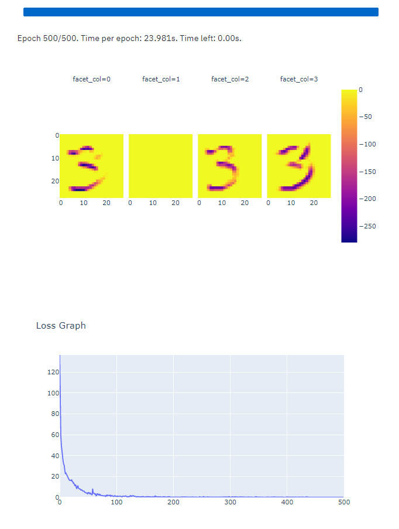
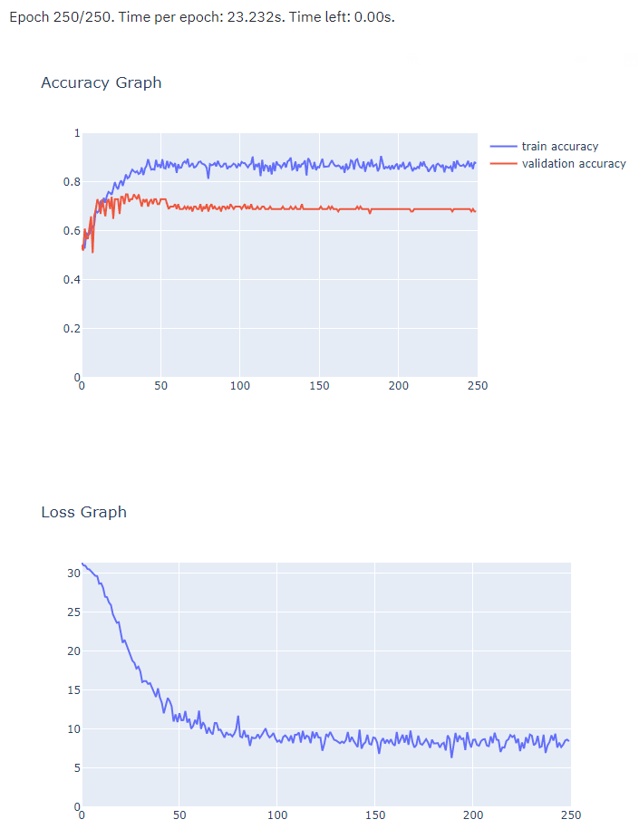

# MiniTorch Module 4


* Docs: https://minitorch.github.io/

* Overview: https://minitorch.github.io/module4.html

This module requires `fast_ops.py`, `cuda_ops.py`, `scalar.py`, `tensor_functions.py`, `tensor_data.py`, `tensor_ops.py`, `operators.py`, `module.py`, and `autodiff.py` from Module 3.


Additionally you will need to install and download the MNist library.

(On Mac, this may require installing the `wget` command)

```
pip install python-mnist
mnist_get_data.sh
```


* Tests:

```
python run_tests.py
```

This assignment requires the following files from the previous assignments.

        minitorch/tensor_data.py minitorch/tensor_functions.py minitorch/tensor_ops.py minitorch/fast_ops.py minitorch/cuda_ops.py minitorch/operators.py minitorch/module.py minitorch/autodiff.py minitorch/scalar.py project/run_manual.py project/run_scalar.py project/run_tensor.py project/run_fast_tensor.py project/parallel_check.py tests/test_tensor_general.py

# 4.5 Model Training

## Digit classification (MNIST)
<br>

<details><summary>Click here for Digit classification Logs</summary><br>
Epoch  1  loss  2.2964027502783786 correct 2<br>
Epoch  1  loss  11.512691118988306 correct 1<br>
Epoch  1  loss  11.521496314375229 correct 2<br>
Epoch  1  loss  11.480509343352386 correct 3<br>
Epoch  1  loss  11.481657033618117 correct 4<br>
Epoch  1  loss  11.515907851486233 correct 4<br>
Epoch  1  loss  11.477961800754338 correct 5<br>
Epoch  1  loss  11.50713174170538 correct 5<br>
Epoch  1  loss  11.51023448901018 correct 5<br>
Epoch  1  loss  11.488214578317361 correct 5<br>
Epoch  1  loss  11.461106951400888 correct 5<br>
Epoch  1  loss  11.393890285587434 correct 5<br>
Epoch  1  loss  11.45862235223888 correct 5<br>
Epoch  1  loss  11.34001091542984 correct 7<br>
Epoch  1  loss  11.336858343152047 correct 9<br>
Epoch  1  loss  11.150216409174675 correct 7<br>
Epoch  1  loss  11.198204184853378 correct 7<br>
Epoch  1  loss  11.046596762862961 correct 10<br>
Epoch  1  loss  10.686867799994054 correct 10<br>
Epoch  1  loss  10.425949041447229 correct 8<br>
Epoch  1  loss  10.049947268346838 correct 9<br>
Epoch  1  loss  9.309477584387919 correct 9<br>
Epoch  1  loss  8.8472989826372 correct 10<br>
Epoch  1  loss  9.001912143412891 correct 10<br>
Epoch  1  loss  7.897420083126708 correct 10<br>
Epoch  1  loss  8.319236580401475 correct 12<br>
Epoch  1  loss  8.098749448159086 correct 12<br>
Epoch  1  loss  6.782906540852387 correct 11<br>
Epoch  1  loss  7.397117378092547 correct 10<br>
Epoch  1  loss  7.200583132478261 correct 10<br>
Epoch  1  loss  7.779574271959019 correct 12<br>
Epoch  1  loss  7.579739187888655 correct 8<br>
Epoch  1  loss  7.394734803206862 correct 10<br>
Epoch  1  loss  6.481200140947153 correct 12<br>
Epoch  1  loss  7.064438994132232 correct 12<br>
Epoch  1  loss  5.820671044830876 correct 10<br>
Epoch  1  loss  6.777124554332132 correct 11<br>
Epoch  1  loss  6.011362948902693 correct 13<br>
Epoch  1  loss  6.121655295290712 correct 13<br>
Epoch  1  loss  7.404166235029502 correct 13<br>
Epoch  1  loss  6.154669410505353 correct 13<br>
Epoch  1  loss  5.984722962761308 correct 13<br>
Epoch  1  loss  6.1002269979424675 correct 13<br>
Epoch  1  loss  7.027508863001512 correct 12<br>
Epoch  1  loss  6.832797069490927 correct 12<br>
Epoch  1  loss  6.231694390030682 correct 13<br>
Epoch  1  loss  5.572978475100232 correct 14<br>
Epoch  1  loss  6.376797442497056 correct 12<br>
Epoch  1  loss  6.800848976347873 correct 12<br>
Epoch  1  loss  7.732616498214805 correct 9<br>
Epoch  1  loss  8.742464821923715 correct 9<br>
Epoch  1  loss  7.907341046493444 correct 9<br>
Epoch  1  loss  8.583756368773233 correct 9<br>
Epoch  1  loss  7.761915470933062 correct 10<br>
Epoch  1  loss  7.24206785565695 correct 9<br>
Epoch  1  loss  6.266797375935887 correct 10<br>
Epoch  1  loss  7.602729541666569 correct 9<br>
Epoch  1  loss  6.998054197561595 correct 10<br>
Epoch  1  loss  7.424259185446256 correct 10<br>
Epoch  1  loss  6.692146726347213 correct 10<br>
Epoch  1  loss  6.686258084078654 correct 10<br>
Epoch  1  loss  6.447430491470699 correct 10<br>
Epoch  1  loss  5.825821589626759 correct 12<br>
Epoch  2  loss  1.2281004418480415 correct 12<br>
Epoch  2  loss  6.933895445362669 correct 12<br>
Epoch  2  loss  6.5308548206184245 correct 11<br>
Epoch  2  loss  5.907354981234571 correct 12<br>
Epoch  2  loss  4.761682122400916 correct 12<br>
Epoch  2  loss  6.216554651735774 correct 12<br>
Epoch  2  loss  6.380512203598998 correct 11<br>
Epoch  2  loss  6.088251804529147 correct 11<br>
Epoch  2  loss  6.614462466973891 correct 11<br>
Epoch  2  loss  6.296181161992906 correct 12<br>
Epoch  2  loss  6.627796459895387 correct 12<br>
Epoch  2  loss  5.686443648571614 correct 11<br>
Epoch  2  loss  6.644774245320836 correct 12<br>
Epoch  2  loss  6.680088124228883 correct 12<br>
Epoch  2  loss  7.302904344470984 correct 12<br>
Epoch  2  loss  5.4422141132195865 correct 12<br>
Epoch  2  loss  7.032218617134882 correct 13<br>
Epoch  2  loss  6.834195978323719 correct 12<br>
Epoch  2  loss  5.872455328609448 correct 13<br>
Epoch  2  loss  4.695261702563373 correct 12<br>
Epoch  2  loss  4.6063982206915695 correct 13<br>
Epoch  2  loss  3.947961308863048 correct 13<br>
Epoch  2  loss  2.9579411289034554 correct 13<br>
Epoch  2  loss  3.608497806845965 correct 12<br>
Epoch  2  loss  3.5051138584463057 correct 12<br>
Epoch  2  loss  4.288932677707748 correct 13<br>
Epoch  2  loss  5.390597851897467 correct 13<br>
Epoch  2  loss  4.097936246971676 correct 13<br>
Epoch  2  loss  3.694305409185562 correct 13<br>
Epoch  2  loss  3.9149192371350576 correct 13<br>
Epoch  2  loss  4.488553878167604 correct 13<br>
Epoch  2  loss  4.21888199035724 correct 12<br>
Epoch  2  loss  4.063323388936357 correct 13<br>
Epoch  2  loss  4.3349908788106335 correct 13<br>
Epoch  2  loss  5.656023796011408 correct 13<br>
Epoch  2  loss  3.9732217048702223 correct 14<br>
Epoch  2  loss  3.6017592147917847 correct 13<br>
Epoch  2  loss  3.8573855613005166 correct 13<br>
Epoch  2  loss  3.477658550648069 correct 13<br>
Epoch  2  loss  4.330424324909291 correct 14<br>
Epoch  2  loss  3.691601697948268 correct 13<br>
Epoch  2  loss  3.1288338579826513 correct 14<br>
Epoch  2  loss  3.427925617580262 correct 14<br>
Epoch  2  loss  2.677724651127977 correct 13<br>
Epoch  2  loss  3.796068239297396 correct 13<br>
Epoch  2  loss  2.018507315563648 correct 14<br>
Epoch  2  loss  2.9551005779937114 correct 13<br>
Epoch  2  loss  3.5767785716035387 correct 13<br>
Epoch  2  loss  3.1746169981328283 correct 13<br>
Epoch  2  loss  2.9645526209085906 correct 13<br>
Epoch  2  loss  3.7626224004858044 correct 14<br>
Epoch  2  loss  3.4941376983015466 correct 14<br>
Epoch  2  loss  3.8366209940061085 correct 13<br>
Epoch  2  loss  3.018569635204055 correct 13<br>
Epoch  2  loss  3.8706997896145166 correct 13<br>
Epoch  2  loss  3.3785042046392406 correct 13<br>
Epoch  2  loss  4.420802387264368 correct 13<br>
Epoch  2  loss  3.1512974962794162 correct 13<br>
Epoch  2  loss  3.945634187349777 correct 13<br>
Epoch  2  loss  3.6866913345153565 correct 14<br>
Epoch  2  loss  3.375616725103924 correct 13<br>
Epoch  2  loss  3.2603687978277245 correct 13<br>
Epoch  2  loss  4.0749545648778955 correct 13<br>
Epoch  3  loss  0.5277542827629813 correct 14<br>
Epoch  3  loss  3.87640646920139 correct 14<br>
Epoch  3  loss  3.6699774043905355 correct 14<br>
Epoch  3  loss  3.4626941300778884 correct 13<br>
Epoch  3  loss  2.3709729595421805 correct 13<br>
Epoch  3  loss  2.793261733828353 correct 14<br>
Epoch  3  loss  3.067605215404754 correct 13<br>
Epoch  3  loss  3.6872876581589114 correct 13<br>
Epoch  3  loss  3.2538474536683575 correct 13<br>
Epoch  3  loss  2.806165845529648 correct 14<br>
Epoch  3  loss  2.6509191730312955 correct 14<br>
Epoch  3  loss  3.021724328990268 correct 14<br>
Epoch  3  loss  3.923015669626813 correct 12<br>
Epoch  3  loss  3.899145743459509 correct 12<br>
Epoch  3  loss  3.6212813248850235 correct 12<br>
Epoch  3  loss  2.884453660763043 correct 14<br>
Epoch  3  loss  5.329672720689343 correct 14<br>
Epoch  3  loss  4.828562198526957 correct 13<br>
Epoch  3  loss  3.7495845793078857 correct 13<br>
Epoch  3  loss  2.5661697592450854 correct 13<br>
Epoch  3  loss  2.702185826774397 correct 13<br>
Epoch  3  loss  2.540606177789946 correct 14<br>
Epoch  3  loss  1.659959343894714 correct 14<br>
Epoch  3  loss  2.206338799945981 correct 14<br>
Epoch  3  loss  2.397890397595474 correct 14<br>
Epoch  3  loss  2.4882543926453935 correct 14<br>
Epoch  3  loss  3.324370943819879 correct 14<br>
Epoch  3  loss  1.8442528392328525 correct 14<br>
Epoch  3  loss  1.733842495966611 correct 14<br>
Epoch  3  loss  1.2144389503512918 correct 14<br>
Epoch  3  loss  2.292633473813775 correct 13<br>
Epoch  3  loss  2.5179603815106475 correct 12<br>
Epoch  3  loss  2.6343774106939453 correct 14<br>
Epoch  3  loss  2.505135647694214 correct 13<br>
Epoch  3  loss  3.5195656664130626 correct 14<br>
Epoch  3  loss  3.118831262971019 correct 14<br>
Epoch  3  loss  2.7094585308285604 correct 13<br>
Epoch  3  loss  2.6088828183203447 correct 14<br>
Epoch  3  loss  2.2904006263930863 correct 14<br>
Epoch  3  loss  3.2089349414033568 correct 14<br>
Epoch  3  loss  2.7960794966938356 correct 14<br>
Epoch  3  loss  2.296633797920812 correct 14<br>
Epoch  3  loss  3.118310893687427 correct 14<br>
Epoch  3  loss  1.574861491869801 correct 14<br>
Epoch  3  loss  2.8091877720233267 correct 14<br>
Epoch  3  loss  1.1579855807994555 correct 14<br>
Epoch  3  loss  2.338636256516046 correct 14<br>
Epoch  3  loss  2.526373688380857 correct 14<br>
Epoch  3  loss  2.176248863061844 correct 14<br>
Epoch  3  loss  2.115352102954107 correct 14<br>
Epoch  3  loss  2.1980924381533455 correct 14<br>
Epoch  3  loss  2.5285383544999958 correct 14<br>
Epoch  3  loss  2.7259387482289976 correct 14<br>
Epoch  3  loss  1.4881625698020904 correct 14<br>
Epoch  3  loss  2.612345535648433 correct 14<br>
Epoch  3  loss  1.716834596779346 correct 14<br>
Epoch  3  loss  2.289183782333377 correct 14<br>
Epoch  3  loss  2.0863963197128035 correct 14<br>
Epoch  3  loss  2.383923191765825 correct 14<br>
Epoch  3  loss  2.559804664283031 correct 14<br>
Epoch  3  loss  1.7239112060019275 correct 14<br>
Epoch  3  loss  1.5651337431021852 correct 14<br>
Epoch  3  loss  2.441781393642053 correct 13<br>
Epoch  4  loss  0.20680534337753845 correct 14<br>
Epoch  4  loss  2.5689996289625627 correct 14<br>
Epoch  4  loss  2.648518725802488 correct 14<br>
Epoch  4  loss  2.3946010094487202 correct 14<br>
Epoch  4  loss  1.288645829702259 correct 14<br>
Epoch  4  loss  1.7602343509549665 correct 14<br>
Epoch  4  loss  2.19427512772328 correct 14<br>
Epoch  4  loss  2.8398734787657602 correct 14<br>
Epoch  4  loss  2.6506561170214806 correct 14<br>
Epoch  4  loss  2.108756024644303 correct 14<br>
Epoch  4  loss  1.7587310174967625 correct 14<br>
Epoch  4  loss  2.3051091090801545 correct 14<br>
Epoch  4  loss  2.898646788853976 correct 14<br>
Epoch  4  loss  3.0415527746934177 correct 14<br>
Epoch  4  loss  2.6634223685453335 correct 14<br>
Epoch  4  loss  2.044637240388755 correct 14<br>
Epoch  4  loss  4.269190061036763 correct 14<br>
Epoch  4  loss  3.640836461960693 correct 13<br>
Epoch  4  loss  3.1949552453403296 correct 14<br>
Epoch  4  loss  2.280096847623134 correct 14<br>
Epoch  4  loss  2.0992466161829295 correct 14<br>
Epoch  4  loss  1.7164930034743802 correct 14<br>
Epoch  4  loss  1.4364311122762297 correct 14<br>
Epoch  4  loss  2.078402597424324 correct 14<br>
Epoch  4  loss  2.3966188395235926 correct 14<br>
Epoch  4  loss  2.0564099399310747 correct 14<br>
Epoch  4  loss  2.647400201533686 correct 14<br>
Epoch  4  loss  1.5906709909805465 correct 14<br>
Epoch  4  loss  1.830458022236727 correct 14<br>
Epoch  4  loss  1.2935130227137426 correct 14<br>
Epoch  4  loss  1.8675714544911755 correct 13<br>
Epoch  4  loss  1.9317522196017853 correct 12<br>
Epoch  4  loss  2.25421796806507 correct 14<br>
Epoch  4  loss  2.1364694813805003 correct 14<br>
Epoch  4  loss  2.9791526888867983 correct 14<br>
Epoch  4  loss  2.477177703950053 correct 14<br>
Epoch  4  loss  2.304827269618457 correct 14<br>
Epoch  4  loss  1.9002888674688636 correct 14<br>
Epoch  4  loss  1.5660226475499996 correct 14<br>
Epoch  4  loss  1.985510483833788 correct 15<br>
Epoch  4  loss  2.2201200761172624 correct 14<br>
Epoch  4  loss  1.8431869566478354 correct 14<br>
Epoch  4  loss  1.9930272506308533 correct 14<br>
Epoch  4  loss  1.4073474511046438 correct 14<br>
Epoch  4  loss  2.2989768777605493 correct 14<br>
Epoch  4  loss  1.5594211575807624 correct 15<br>
Epoch  4  loss  1.9381687136340295 correct 14<br>
Epoch  4  loss  2.22472305155122 correct 14<br>
Epoch  4  loss  1.6354071182550882 correct 14<br>
Epoch  4  loss  1.2250451408637661 correct 14<br>
Epoch  4  loss  1.664152494275497 correct 14<br>
Epoch  4  loss  2.5199771823286214 correct 14<br>
Epoch  4  loss  2.208930566072294 correct 14<br>
Epoch  4  loss  1.4675884935102337 correct 15<br>
Epoch  4  loss  2.2038628691555227 correct 13<br>
Epoch  4  loss  1.5392696637337702 correct 15<br>
Epoch  4  loss  2.1066171152404567 correct 14<br>
Epoch  4  loss  1.5720310973680296 correct 14<br>
Epoch  4  loss  1.931304035272039 correct 14<br>
Epoch  4  loss  2.3163847783302547 correct 14<br>
Epoch  4  loss  1.6902712764939278 correct 14<br>
Epoch  4  loss  1.543534044228492 correct 14<br>
Epoch  4  loss  1.8581954527418425 correct 15<br>
Epoch  5  loss  0.1742797977366836 correct 15<br>
Epoch  5  loss  2.1411850959374585 correct 15<br>
Epoch  5  loss  2.4953923480163347 correct 14<br>
Epoch  5  loss  2.062634098277891 correct 14<br>
Epoch  5  loss  1.4276753360925056 correct 14<br>
Epoch  5  loss  1.4602951439235263 correct 14<br>
Epoch  5  loss  1.7169566724599363 correct 14<br>
Epoch  5  loss  2.097549756818678 correct 14<br>
Epoch  5  loss  1.7546049846607765 correct 14<br>
Epoch  5  loss  1.6346711987154738 correct 14<br>
Epoch  5  loss  0.920997735530224 correct 14<br>
Epoch  5  loss  2.2903183569463446 correct 13<br>
Epoch  5  loss  2.513173693376732 correct 13<br>
Epoch  5  loss  2.233553920354429 correct 13<br>
Epoch  5  loss  2.2062302319846934 correct 12<br>
Epoch  5  loss  1.114718839468015 correct 13<br>
Epoch  5  loss  3.35594948515436 correct 14<br>
Epoch  5  loss  3.1565411677386046 correct 14<br>
Epoch  5  loss  2.360952051764981 correct 14<br>
Epoch  5  loss  1.7431444821966082 correct 14<br>
Epoch  5  loss  1.8699706287777278 correct 14<br>
Epoch  5  loss  1.8012391742060732 correct 13<br>
Epoch  5  loss  0.9298081936603134 correct 14<br>
Epoch  5  loss  1.352491885766404 correct 14<br>
Epoch  5  loss  1.9870964251748666 correct 14<br>
Epoch  5  loss  1.9269497809245437 correct 14<br>
Epoch  5  loss  1.9246804212683637 correct 14<br>
Epoch  5  loss  1.1887941197691856 correct 14<br>
Epoch  5  loss  1.617766860271709 correct 14<br>
Epoch  5  loss  0.9182712398104717 correct 14<br>
Epoch  5  loss  1.696141275983863 correct 14<br>
Epoch  5  loss  1.5690284549566074 correct 14<br>
Epoch  5  loss  1.5980931338033324 correct 14<br>
Epoch  5  loss  1.9517594983964597 correct 15<br>
Epoch  5  loss  2.5905739330689217 correct 15<br>
Epoch  5  loss  1.9587926531188313 correct 15<br>
Epoch  5  loss  1.693828257037127 correct 15<br>
Epoch  5  loss  1.701433378382645 correct 14<br>
Epoch  5  loss  1.3747057743939881 correct 15<br>
Epoch  5  loss  1.9481575159255065 correct 15<br>
Epoch  5  loss  1.477561885285743 correct 15<br>
Epoch  5  loss  1.39763257084336 correct 15<br>
Epoch  5  loss  1.975236870435852 correct 15<br>
Epoch  5  loss  1.0915224438761348 correct 15<br>
Epoch  5  loss  1.8212292136217205 correct 14<br>
Epoch  5  loss  1.1930157542648765 correct 14<br>
Epoch  5  loss  1.5984701105156618 correct 15<br>
Epoch  5  loss  2.236724600393039 correct 14<br>
Epoch  5  loss  1.3227570227286702 correct 15<br>
Epoch  5  loss  1.5005748032207804 correct 14<br>
Epoch  5  loss  1.7157772246652307 correct 14<br>
Epoch  5  loss  2.1718552816102075 correct 15<br>
Epoch  5  loss  1.9241426746284787 correct 15<br>
Epoch  5  loss  1.0335137170619324 correct 15<br>
Epoch  5  loss  2.007212175589626 correct 13<br>
Epoch  5  loss  1.337817457088826 correct 15<br>
Epoch  5  loss  1.7152678068059068 correct 15<br>
Epoch  5  loss  1.6206414715064794 correct 15<br>
Epoch  5  loss  1.735897601507355 correct 15<br>
Epoch  5  loss  2.1844303146167325 correct 14<br>
Epoch  5  loss  1.787014104888296 correct 15<br>
Epoch  5  loss  1.209583294631369 correct 14<br>
Epoch  5  loss  1.84329747492117 correct 15<br>
Epoch  6  loss  0.1218209823251668 correct 15<br>
Epoch  6  loss  1.57906217757912 correct 15<br>
Epoch  6  loss  2.2365680133247694 correct 14<br>
Epoch  6  loss  1.8822324145142795 correct 14<br>
Epoch  6  loss  1.0405302150126006 correct 14<br>
Epoch  6  loss  1.4269036273878053 correct 14<br>
Epoch  6  loss  1.7641908290278037 correct 14<br>
Epoch  6  loss  1.5738001435124842 correct 14<br>
Epoch  6  loss  1.8722533712689038 correct 14<br>
Epoch  6  loss  1.0325677911930016 correct 14<br>
Epoch  6  loss  0.7498731184987112 correct 14<br>
Epoch  6  loss  1.970898334833315 correct 14<br>
Epoch  6  loss  1.9165303643201037 correct 13<br>
Epoch  6  loss  1.624338658467813 correct 13<br>
Epoch  6  loss  1.8629233556622076 correct 14<br>
Epoch  6  loss  1.2704906343011795 correct 14<br>
Epoch  6  loss  3.2066188636432145 correct 14<br>
Epoch  6  loss  2.364585243917222 correct 14<br>
Epoch  6  loss  1.78117411831592 correct 15<br>
Epoch  6  loss  1.4848019637878622 correct 14<br>
Epoch  6  loss  1.4880820144149003 correct 13<br>
Epoch  6  loss  1.4933028886908088 correct 15<br>
Epoch  6  loss  1.0183580002353732 correct 14<br>
Epoch  6  loss  1.409187339653433 correct 14<br>
Epoch  6  loss  1.5155912875992228 correct 14<br>
Epoch  6  loss  1.9867651222106584 correct 14<br>
Epoch  6  loss  1.6795957289904 correct 14<br>
Epoch  6  loss  1.0065417711573812 correct 14<br>
Epoch  6  loss  1.9297374934114393 correct 14<br>
Epoch  6  loss  0.7121495639066604 correct 14<br>
Epoch  6  loss  1.8096380883166225 correct 13<br>
Epoch  6  loss  1.5458090562005777 correct 13<br>
Epoch  6  loss  1.496059630826685 correct 15<br>
Epoch  6  loss  1.7215827580167902 correct 15<br>
Epoch  6  loss  2.629064954160492 correct 15<br>
Epoch  6  loss  1.77455041815815 correct 14<br>
Epoch  6  loss  1.3033237683725014 correct 14<br>
Epoch  6  loss  1.3002858939103688 correct 14<br>
Epoch  6  loss  1.4796169261598802 correct 15<br>
Epoch  6  loss  1.748282604371198 correct 14<br>
Epoch  6  loss  1.1321032751328792 correct 14<br>
Epoch  6  loss  0.9696074005826685 correct 14<br>
Epoch  6  loss  1.4880376446285521 correct 15<br>
Epoch  6  loss  1.0550251881760928 correct 15<br>
Epoch  6  loss  1.7737950252780803 correct 15<br>
Epoch  6  loss  0.8391305464497744 correct 15<br>
Epoch  6  loss  1.544506657212898 correct 15<br>
Epoch  6  loss  2.0225612564622626 correct 14<br>
Epoch  6  loss  1.583754033271751 correct 15<br>
Epoch  6  loss  1.575530524421508 correct 15<br>
Epoch  6  loss  1.7174427833254322 correct 15<br>
Epoch  6  loss  1.6914142293518215 correct 15<br>
Epoch  6  loss  1.6540044108706486 correct 15<br>
Epoch  6  loss  0.9037936433330743 correct 15<br>
Epoch  6  loss  1.968239918321844 correct 13<br>
Epoch  6  loss  1.560599422808712 correct 15<br>
Epoch  6  loss  1.5409364986843086 correct 15<br>
Epoch  6  loss  1.190052893805982 correct 14<br>
Epoch  6  loss  1.2920135812935003 correct 14<br>
Epoch  6  loss  1.6623034559957153 correct 14<br>
Epoch  6  loss  1.8951262623148348 correct 15<br>
Epoch  6  loss  0.7567666866656829 correct 14<br>
Epoch  6  loss  1.764138770641527 correct 15<br>
Epoch  7  loss  0.05058376579264551 correct 15<br>
Epoch  7  loss  1.7858971014604275 correct 15<br>
Epoch  7  loss  1.4678609499490733 correct 15<br>
Epoch  7  loss  1.364711581510885 correct 14<br>
Epoch  7  loss  0.6570790931403279 correct 14<br>
Epoch  7  loss  1.3869646627804044 correct 15<br>
Epoch  7  loss  1.7444006297512038 correct 15<br>
Epoch  7  loss  2.555427906108101 correct 14<br>
Epoch  7  loss  1.40917878657639 correct 14<br>
Epoch  7  loss  1.2446566411707984 correct 14<br>
Epoch  7  loss  0.7750680078710253 correct 14<br>
Epoch  7  loss  1.6554578507909854 correct 14<br>
Epoch  7  loss  1.9379281758432092 correct 13<br>
Epoch  7  loss  1.6535925653163726 correct 13<br>
Epoch  7  loss  1.4348260369045804 correct 13<br>
Epoch  7  loss  1.167589726733154 correct 14<br>
Epoch  7  loss  3.3555474075009126 correct 14<br>
Epoch  7  loss  2.52484976315308 correct 15<br>
Epoch  7  loss  1.778886692985311 correct 14<br>
Epoch  7  loss  1.4423617062371188 correct 14<br>
Epoch  7  loss  1.5139103307986264 correct 15<br>
Epoch  7  loss  1.6966041586800793 correct 14<br>
Epoch  7  loss  0.6462519479461851 correct 14<br>
Epoch  7  loss  1.4884549926229182 correct 14<br>
Epoch  7  loss  1.5929833069152421 correct 14<br>
Epoch  7  loss  2.050232093872955 correct 14<br>
Epoch  7  loss  1.6654383549746508 correct 14<br>
Epoch  7  loss  1.054746665265495 correct 14<br>
Epoch  7  loss  1.5711724686853685 correct 14<br>
Epoch  7  loss  0.7677142959043087 correct 14<br>
Epoch  7  loss  1.663595889676078 correct 15<br>
Epoch  7  loss  1.5677509834290086 correct 15<br>
Epoch  7  loss  1.2063361004773165 correct 15<br>
Epoch  7  loss  1.4702304215733237 correct 15<br>
Epoch  7  loss  2.2290739341406463 correct 15<br>
Epoch  7  loss  1.5007656650726744 correct 15<br>
Epoch  7  loss  1.2622817094684486 correct 14<br>
Epoch  7  loss  1.0420698279657008 correct 14<br>
Epoch  7  loss  0.972279957147323 correct 15<br>
Epoch  7  loss  1.305453641143316 correct 15<br>
Epoch  7  loss  1.2006038755103843 correct 14<br>
Epoch  7  loss  1.2179053707629457 correct 14<br>
Epoch  7  loss  1.7106283100304622 correct 14<br>
Epoch  7  loss  0.8352273108800239 correct 15<br>
Epoch  7  loss  1.8200554757225502 correct 15<br>
Epoch  7  loss  0.908002124191104 correct 15<br>
Epoch  7  loss  1.3136556059854474 correct 15<br>
Epoch  7  loss  2.2347067298901235 correct 14<br>
Epoch  7  loss  1.1591227146310907 correct 15<br>
Epoch  7  loss  1.1951249253392735 correct 15<br>
Epoch  7  loss  1.3596644066439472 correct 15<br>
Epoch  7  loss  1.6817843581997802 correct 15<br>
Epoch  7  loss  1.2196540390041564 correct 15<br>
Epoch  7  loss  0.787436863426198 correct 15<br>
Epoch  7  loss  2.1312993938133467 correct 14<br>
Epoch  7  loss  1.2259813291717667 correct 14<br>
Epoch  7  loss  1.6632562962253044 correct 15<br>
Epoch  7  loss  1.5078711169300139 correct 15<br>
Epoch  7  loss  1.2348731500204568 correct 15<br>
Epoch  7  loss  1.6678540250804967 correct 15<br>
Epoch  7  loss  1.4396045712318357 correct 15<br>
Epoch  7  loss  1.1842815258837194 correct 15<br>
Epoch  7  loss  1.4352695898160965 correct 15<br>
Epoch  8  loss  0.05058045255544019 correct 15<br>
Epoch  8  loss  1.5115127759299736 correct 15<br>
Epoch  8  loss  2.0656729609306006 correct 15<br>
Epoch  8  loss  1.1871453558168865 correct 14<br>
Epoch  8  loss  0.5714252770570156 correct 14<br>
Epoch  8  loss  1.4576410172163556 correct 15<br>
Epoch  8  loss  1.2326879250745844 correct 15<br>
Epoch  8  loss  1.4470586113494264 correct 14<br>
Epoch  8  loss  1.7229889033550903 correct 15<br>
Epoch  8  loss  0.5917046465133582 correct 15<br>
Epoch  8  loss  0.8666467680376002 correct 14<br>
Epoch  8  loss  1.5605969305032108 correct 14<br>
Epoch  8  loss  1.0329782695219267 correct 14<br>
Epoch  8  loss  2.1382216259143494 correct 13<br>
Epoch  8  loss  0.9609007867692092 correct 14<br>
Epoch  8  loss  1.0970503452901734 correct 14<br>
Epoch  8  loss  3.72400218009402 correct 14<br>
Epoch  8  loss  1.977800278894018 correct 14<br>
Epoch  8  loss  1.5155922964021988 correct 14<br>
Epoch  8  loss  1.4012809398687234 correct 14<br>
Epoch  8  loss  1.095517780382444 correct 13<br>
Epoch  8  loss  1.4953267804971286 correct 14<br>
Epoch  8  loss  0.3839392374053622 correct 14<br>
Epoch  8  loss  1.022407576303312 correct 14<br>
Epoch  8  loss  1.3784257535734739 correct 14<br>
Epoch  8  loss  1.529840182682594 correct 14<br>
Epoch  8  loss  1.5848170335013172 correct 15<br>
Epoch  8  loss  0.7970526070531254 correct 14<br>
Epoch  8  loss  1.4001076595722999 correct 14<br>
Epoch  8  loss  0.6791570712370467 correct 14<br>
Epoch  8  loss  1.2895839302689933 correct 15<br>
Epoch  8  loss  1.18103536598539 correct 14<br>
Epoch  8  loss  0.9484516379237423 correct 15<br>
Epoch  8  loss  1.5855179336344942 correct 15<br>
Epoch  8  loss  1.8561601870112407 correct 15<br>
Epoch  8  loss  1.486301964982903 correct 15<br>
Epoch  8  loss  1.0694725339269682 correct 15<br>
Epoch  8  loss  1.0121286963624814 correct 15<br>
Epoch  8  loss  1.14553451233415 correct 15<br>
Epoch  8  loss  1.3196946379578034 correct 15<br>
Epoch  8  loss  1.1401353673868997 correct 15<br>
Epoch  8  loss  0.8155924543057059 correct 15<br>
Epoch  8  loss  1.259036581668388 correct 15<br>
Epoch  8  loss  0.8093372983353919 correct 15<br>
Epoch  8  loss  1.4934685201326352 correct 15<br>
Epoch  8  loss  0.9106031952979354 correct 15<br>
Epoch  8  loss  1.0792916985910306 correct 15<br>
Epoch  8  loss  2.137953307175855 correct 14<br>
Epoch  8  loss  1.237910877980332 correct 15<br>
Epoch  8  loss  0.9439169720070788 correct 15<br>
Epoch  8  loss  1.4902576267547283 correct 15<br>
Epoch  8  loss  1.5992956221128338 correct 15<br>
Epoch  8  loss  0.9550698317098089 correct 15<br>
Epoch  8  loss  0.8431390381759343 correct 15<br>
Epoch  8  loss  1.9510600135282032 correct 14<br>
Epoch  8  loss  1.2315461244237422 correct 15<br>
Epoch  8  loss  1.2863527198818674 correct 15<br>
Epoch  8  loss  1.2542773814841284 correct 15<br>
Epoch  8  loss  0.861464921404598 correct 15<br>
Epoch  8  loss  1.2651403075588465 correct 16<br>
Epoch  8  loss  1.4984750532013336 correct 15<br>
Epoch  8  loss  1.2037539969311295 correct 14<br>
Epoch  8  loss  1.2866313621130812 correct 15<br>
Epoch  9  loss  0.06394752841137047 correct 15<br>
Epoch  9  loss  1.6008921220778118 correct 16<br>
Epoch  9  loss  1.5217064517878738 correct 16<br>
Epoch  9  loss  1.188846811107873 correct 14<br>
Epoch  9  loss  0.5623091660621671 correct 15<br>
Epoch  9  loss  1.1441551198753053 correct 15<br>
Epoch  9  loss  1.6125028911474972 correct 15<br>
Epoch  9  loss  1.3920128789731736 correct 15<br>
Epoch  9  loss  1.7319941600730022 correct 15<br>
Epoch  9  loss  0.8988694731388259 correct 15<br>
Epoch  9  loss  0.8409225695740958 correct 16<br>
Epoch  9  loss  1.3699849551298322 correct 15<br>
Epoch  9  loss  1.2598295786659035 correct 15<br>
Epoch  9  loss  1.3285012770549205 correct 14<br>
Epoch  9  loss  1.5498607032159173 correct 13<br>
Epoch  9  loss  1.1075021453165677 correct 15<br>
Epoch  9  loss  2.309567518234747 correct 16<br>
Epoch  9  loss  2.5243849903609785 correct 16<br>
Epoch  9  loss  1.4813387778258313 correct 16<br>
Epoch  9  loss  0.7890829877431571 correct 16<br>
Epoch  9  loss  1.2930908732469986 correct 15<br>
Epoch  9  loss  1.8333743741732307 correct 15<br>
Epoch  9  loss  0.49104562197410406 correct 15<br>
Epoch  9  loss  0.9126222921041391 correct 15<br>
Epoch  9  loss  0.9904879693253205 correct 15<br>
Epoch  9  loss  1.6787993704175592 correct 14<br>
Epoch  9  loss  1.5814473358559171 correct 16<br>
Epoch  9  loss  0.6749641698697498 correct 16<br>
Epoch  9  loss  1.1411103948833055 correct 15<br>
Epoch  9  loss  0.5078794869610254 correct 15<br>
Epoch  9  loss  1.2479840432024767 correct 15<br>
Epoch  9  loss  1.2518883202914386 correct 16<br>
Epoch  9  loss  0.7454981888187632 correct 15<br>
Epoch  9  loss  1.264982386567038 correct 15<br>
Epoch  9  loss  1.6622807701702476 correct 16<br>
Epoch  9  loss  1.134670860980833 correct 15<br>
Epoch  9  loss  0.8772247646082765 correct 15<br>
Epoch  9  loss  0.9367029820981191 correct 16<br>
Epoch  9  loss  0.7572973815220696 correct 16<br>
Epoch  9  loss  1.2227102566674914 correct 15<br>
Epoch  9  loss  1.0095599935947095 correct 15<br>
Epoch  9  loss  1.1685122517816118 correct 16<br>
Epoch  9  loss  1.28148459295838 correct 16<br>
Epoch  9  loss  0.7407814653074669 correct 15<br>
Epoch  9  loss  1.432011054471947 correct 16<br>
Epoch  9  loss  0.7564047453929734 correct 16<br>
Epoch  9  loss  1.2989631518878524 correct 15<br>
Epoch  9  loss  1.9131644224416056 correct 15<br>
Epoch  9  loss  1.1180936073811556 correct 15<br>
Epoch  9  loss  0.980703633235163 correct 16<br>
Epoch  9  loss  0.9145481060838486 correct 15<br>
Epoch  9  loss  1.3188854680375488 correct 15<br>
Epoch  9  loss  1.17109700596874 correct 15<br>
Epoch  9  loss  0.673600326007201 correct 15<br>
Epoch  9  loss  1.6937411927634152 correct 15<br>
Epoch  9  loss  0.7522026404890803 correct 15<br>
Epoch  9  loss  1.2382962098327783 correct 15<br>
Epoch  9  loss  1.0619429561221887 correct 15<br>
Epoch  9  loss  1.018712908209627 correct 15<br>
Epoch  9  loss  1.5826426249495806 correct 16<br>
Epoch  9  loss  0.7732806377531678 correct 15<br>
Epoch  9  loss  0.7816535010707903 correct 16<br>
Epoch  9  loss  1.4259593251715008 correct 15<br>
Epoch  10  loss  0.047496958523658095 correct 16<br>
Epoch  10  loss  1.6830680379645822 correct 16<br>
Epoch  10  loss  1.5678091214077672 correct 15<br>
Epoch  10  loss  1.327803664748689 correct 15<br>
Epoch  10  loss  0.5051184254544365 correct 15<br>
Epoch  10  loss  1.2986477168771793 correct 15<br>
Epoch  10  loss  1.5002506567991658 correct 15<br>
Epoch  10  loss  1.6396760806665625 correct 14<br>
Epoch  10  loss  1.487999608069007 correct 15<br>
Epoch  10  loss  0.6770106361490698 correct 15<br>
Epoch  10  loss  0.5193882496301321 correct 16<br>
Epoch  10  loss  1.7010152516649122 correct 15<br>
Epoch  10  loss  0.9681008475645693 correct 15<br>
Epoch  10  loss  1.0984626100646526 correct 13<br>
Epoch  10  loss  0.9298121582978957 correct 13<br>
Epoch  10  loss  0.9462021472457356 correct 15<br>
Epoch  10  loss  2.174735765497072 correct 16<br>
Epoch  10  loss  1.7230567726211783 correct 16<br>
Epoch  10  loss  1.6243992557235258 correct 15<br>
Epoch  10  loss  0.7373225104460366 correct 15<br>
Epoch  10  loss  0.7900048712035083 correct 12<br>
Epoch  10  loss  1.5704893343074946 correct 15<br>
Epoch  10  loss  0.524339671340019 correct 15<br>
Epoch  10  loss  1.0575817450799363 correct 15<br>
Epoch  10  loss  0.9622209792519276 correct 14<br>
Epoch  10  loss  1.7491517756619999 correct 14<br>
Epoch  10  loss  1.211713286311536 correct 15<br>
Epoch  10  loss  0.4491748775469882 correct 15<br>
Epoch  10  loss  0.8483762911348325 correct 15<br>
Epoch  10  loss  0.5800136766465052 correct 15<br>
Epoch  10  loss  0.8700835624454334 correct 15<br>
Epoch  10  loss  1.011734118368337 correct 15<br>
Epoch  10  loss  0.9291778030704386 correct 15<br>
Epoch  10  loss  0.9780450724893966 correct 15<br>
Epoch  10  loss  1.9375727367022153 correct 16<br>
Epoch  10  loss  1.2773175872518858 correct 16<br>
Epoch  10  loss  0.7337953519255046 correct 16<br>
Epoch  10  loss  0.8084264544780175 correct 16<br>
Epoch  10  loss  0.9291452296561071 correct 16<br>
Epoch  10  loss  1.1603579153903936 correct 15<br>
Epoch  10  loss  0.7800452316220986 correct 15<br>
Epoch  10  loss  0.8102854210673546 correct 16<br>
Epoch  10  loss  1.0243544469779269 correct 15<br>
Epoch  10  loss  0.5558777742152414 correct 16<br>
Epoch  10  loss  1.773595669527078 correct 16<br>
Epoch  10  loss  0.3483831910747745 correct 16<br>
Epoch  10  loss  0.8394789920792693 correct 15<br>
Epoch  10  loss  1.5161040825113004 correct 15<br>
Epoch  10  loss  1.3667703415898491 correct 15<br>
Epoch  10  loss  0.6097547942531121 correct 16<br>
Epoch  10  loss  0.7161307625449711 correct 15<br>
Epoch  10  loss  1.114875189096664 correct 15<br>
Epoch  10  loss  0.9649721676449126 correct 15<br>
Epoch  10  loss  0.6868035852298012 correct 15<br>
Epoch  10  loss  1.2483250640706345 correct 15<br>
Epoch  10  loss  0.6246295250851976 correct 15<br>
Epoch  10  loss  1.200256979068395 correct 16<br>
Epoch  10  loss  1.0284723598972316 correct 15<br>
Epoch  10  loss  0.9543550908928378 correct 15<br>
Epoch  10  loss  1.2105310133778635 correct 16<br>
Epoch  10  loss  1.0969789781463977 correct 16<br>
Epoch  10  loss  0.8658399132069203 correct 16<br>
Epoch  10  loss  1.468815738713828 correct 15<br>
</details>


## Sentiment (SST2)
<br>

<details><summary>Click here for Sentiment Logs</summary><br>
Initializing model...<br>
Epoch: 1/250, loss: 31.353877655924478, train accuracy: 0.5333333333333333<br>
Epoch: 2/250, loss: 30.999750248439693, train accuracy: 0.5444444444444444<br>
Epoch: 3/250, loss: 30.946453358412374, train accuracy: 0.5288888888888889<br>
Epoch: 4/250, loss: 30.547064316375774, train accuracy: 0.5933333333333334<br>
Epoch: 5/250, loss: 30.480068312593986, train accuracy: 0.5822222222222222<br>
Epoch: 6/250, loss: 30.211536241738262, train accuracy: 0.5888888888888889<br>
Epoch: 7/250, loss: 29.967020549708902, train accuracy: 0.6177777777777778<br>
Epoch: 8/250, loss: 29.66599749485886, train accuracy: 0.6155555555555555<br>
Epoch: 9/250, loss: 29.625823909081625, train accuracy: 0.6266666666666667<br>
Epoch: 10/250, loss: 28.647901948054116, train accuracy: 0.6844444444444444<br>
Epoch: 11/250, loss: 28.707744684512875, train accuracy: 0.6755555555555556<br>
Epoch: 12/250, loss: 28.130488588367395, train accuracy: 0.6822222222222222<br>
Epoch: 13/250, loss: 26.987005231857854, train accuracy: 0.7244444444444444<br>
Epoch: 14/250, loss: 26.926269124615832, train accuracy: 0.6977777777777778<br>
Epoch: 15/250, loss: 26.24253199960727, train accuracy: 0.7355555555555555<br>
Epoch: 16/250, loss: 25.918717545545636, train accuracy: 0.7155555555555555<br>
Epoch: 17/250, loss: 24.73130661848191, train accuracy: 0.7444444444444445<br>
Epoch: 18/250, loss: 24.135243899323324, train accuracy: 0.76<br>
Epoch: 19/250, loss: 23.642820983167866, train accuracy: 0.7555555555555555<br>
Epoch: 20/250, loss: 23.721567157178743, train accuracy: 0.7488888888888889<br>
Epoch: 21/250, loss: 22.522597325290292, train accuracy: 0.7733333333333333<br>
Epoch: 22/250, loss: 21.087642604720514, train accuracy: 0.8<br>
Epoch: 23/250, loss: 21.449235389829205, train accuracy: 0.78<br>
Epoch: 24/250, loss: 20.779558281406732, train accuracy: 0.7711111111111111<br>
Epoch: 25/250, loss: 20.125550908963074, train accuracy: 0.7955555555555556<br>
Epoch: 26/250, loss: 19.55230895518695, train accuracy: 0.8066666666666666<br>
Epoch: 27/250, loss: 18.763093918526444, train accuracy: 0.7844444444444445<br>
Epoch: 28/250, loss: 18.50412100766337, train accuracy: 0.8133333333333334<br>
Epoch: 29/250, loss: 17.781682808462744, train accuracy: 0.8311111111111111<br>
Epoch: 30/250, loss: 18.02308734310407, train accuracy: 0.8155555555555556<br>
Epoch: 31/250, loss: 17.41473491094137, train accuracy: 0.82<br>
Epoch: 32/250, loss: 16.046006178795892, train accuracy: 0.8377777777777777<br>
Epoch: 33/250, loss: 16.175441178508407, train accuracy: 0.8511111111111112<br>
Epoch: 34/250, loss: 16.16984376437702, train accuracy: 0.8444444444444444<br>
Epoch: 35/250, loss: 15.803140548567455, train accuracy: 0.84<br>
Epoch: 36/250, loss: 15.908221262151656, train accuracy: 0.8444444444444444<br>
Epoch: 37/250, loss: 15.287625231690754, train accuracy: 0.8333333333333334<br>
Epoch: 38/250, loss: 14.743369606805386, train accuracy: 0.8377777777777777<br>
Epoch: 39/250, loss: 14.133331015450517, train accuracy: 0.86<br>
Epoch: 40/250, loss: 15.233635981463172, train accuracy: 0.8288888888888889<br>
Epoch: 41/250, loss: 14.062221567524569, train accuracy: 0.8555555555555555<br>
Epoch: 42/250, loss: 13.392030910422339, train accuracy: 0.8666666666666667<br>
Epoch: 43/250, loss: 12.044939619052284, train accuracy: 0.8933333333333333<br>
Epoch: 44/250, loss: 13.011623177489563, train accuracy: 0.8688888888888889<br>
Epoch: 45/250, loss: 14.004295275532277, train accuracy: 0.8511111111111112<br>
Epoch: 46/250, loss: 13.606891366997989, train accuracy: 0.8533333333333334<br>
Epoch: 47/250, loss: 12.947335569575483, train accuracy: 0.8511111111111112<br>
Epoch: 48/250, loss: 10.98387649705613, train accuracy: 0.8911111111111111<br>
Epoch: 49/250, loss: 11.900210767710686, train accuracy: 0.8622222222222222<br>
Epoch: 50/250, loss: 10.902926284567886, train accuracy: 0.8733333333333333<br>
Epoch: 51/250, loss: 12.052923494811537, train accuracy: 0.8577777777777778<br>
Epoch: 52/250, loss: 11.147792651494315, train accuracy: 0.8933333333333333<br>
Epoch: 53/250, loss: 11.16680346870919, train accuracy: 0.8577777777777778<br>
Epoch: 54/250, loss: 12.330814452925635, train accuracy: 0.8555555555555555<br>
Epoch: 55/250, loss: 10.85878764870044, train accuracy: 0.8866666666666667<br>
Epoch: 56/250, loss: 11.34769473687596, train accuracy: 0.8577777777777778<br>
Epoch: 57/250, loss: 10.061568835853366, train accuracy: 0.88<br>
Epoch: 58/250, loss: 10.441791990694291, train accuracy: 0.8755555555555555<br>
Epoch: 59/250, loss: 11.206780912339166, train accuracy: 0.8622222222222222<br>
Epoch: 60/250, loss: 10.623998116399871, train accuracy: 0.8777777777777778<br>
Epoch: 61/250, loss: 12.387126926523646, train accuracy: 0.8377777777777777<br>
Epoch: 62/250, loss: 10.029927151106607, train accuracy: 0.8733333333333333<br>
Epoch: 63/250, loss: 10.89875876463521, train accuracy: 0.8577777777777778<br>
Epoch: 64/250, loss: 10.44829820505414, train accuracy: 0.86<br>
Epoch: 65/250, loss: 9.42595047355027, train accuracy: 0.8777777777777778<br>
Epoch: 66/250, loss: 10.246160462474215, train accuracy: 0.8844444444444445<br>
Epoch: 67/250, loss: 9.607438525778264, train accuracy: 0.8777777777777778<br>
Epoch: 68/250, loss: 9.338801940849207, train accuracy: 0.8955555555555555<br>
Epoch: 69/250, loss: 10.78805273918086, train accuracy: 0.8622222222222222<br>
Epoch: 70/250, loss: 10.784487862752608, train accuracy: 0.8688888888888889<br>
Epoch: 71/250, loss: 9.888969343423502, train accuracy: 0.8777777777777778<br>
Epoch: 72/250, loss: 9.94145758023754, train accuracy: 0.86<br>
Epoch: 73/250, loss: 9.440798192115249, train accuracy: 0.8622222222222222<br>
Epoch: 74/250, loss: 8.931371560833213, train accuracy: 0.8711111111111111<br>
Epoch: 75/250, loss: 9.617122868206717, train accuracy: 0.8822222222222222<br>
Epoch: 76/250, loss: 9.296321675557481, train accuracy: 0.8844444444444445<br>
Epoch: 77/250, loss: 9.359026540154689, train accuracy: 0.8755555555555555<br>
Epoch: 78/250, loss: 9.068296796720597, train accuracy: 0.8733333333333333<br>
Epoch: 79/250, loss: 9.425352137486609, train accuracy: 0.8688888888888889<br>
Epoch: 80/250, loss: 10.046963364094799, train accuracy: 0.8577777777777778<br>
Epoch: 81/250, loss: 11.753747951782909, train accuracy: 0.8133333333333334<br>
Epoch: 82/250, loss: 9.082575890033157, train accuracy: 0.8733333333333333<br>
Epoch: 83/250, loss: 8.946541016804966, train accuracy: 0.8688888888888889<br>
Epoch: 84/250, loss: 9.870055061866701, train accuracy: 0.8711111111111111<br>
Epoch: 85/250, loss: 8.98219732464925, train accuracy: 0.8777777777777778<br>
Epoch: 86/250, loss: 9.261597729734591, train accuracy: 0.8644444444444445<br>
Epoch: 87/250, loss: 7.868333463072043, train accuracy: 0.8866666666666667<br>
Epoch: 88/250, loss: 8.965730395529924, train accuracy: 0.8711111111111111<br>
Epoch: 89/250, loss: 8.847127167752245, train accuracy: 0.8622222222222222<br>
Epoch: 90/250, loss: 8.888228190294127, train accuracy: 0.8644444444444445<br>
Epoch: 91/250, loss: 9.362751585508851, train accuracy: 0.8755555555555555<br>
Epoch: 92/250, loss: 8.884581633330024, train accuracy: 0.8755555555555555<br>
Epoch: 93/250, loss: 9.250375462080713, train accuracy: 0.8533333333333334<br>
Epoch: 94/250, loss: 9.756410497705836, train accuracy: 0.8644444444444445<br>
Epoch: 95/250, loss: 10.105173026689663, train accuracy: 0.8622222222222222<br>
Epoch: 96/250, loss: 9.314484042962325, train accuracy: 0.8688888888888889<br>
Epoch: 97/250, loss: 8.94124491843886, train accuracy: 0.8755555555555555<br>
Epoch: 98/250, loss: 9.156298667528526, train accuracy: 0.8711111111111111<br>
Epoch: 99/250, loss: 9.508989281686212, train accuracy: 0.8577777777777778<br>
Epoch: 100/250, loss: 8.819187340609115, train accuracy: 0.8733333333333333<br>
Epoch: 101/250, loss: 8.400358567807903, train accuracy: 0.8666666666666667<br>
Epoch: 102/250, loss: 8.57770003184616, train accuracy: 0.8822222222222222<br>
Epoch: 103/250, loss: 8.23855357623647, train accuracy: 0.8777777777777778<br>
Epoch: 104/250, loss: 9.017987633599963, train accuracy: 0.8777777777777778<br>
Epoch: 105/250, loss: 9.204358092773301, train accuracy: 0.8688888888888889<br>
Epoch: 106/250, loss: 8.940323341121674, train accuracy: 0.86<br>
Epoch: 107/250, loss: 8.477927363344016, train accuracy: 0.8711111111111111<br>
Epoch: 108/250, loss: 9.193367321115476, train accuracy: 0.8755555555555555<br>
Epoch: 109/250, loss: 8.221347060940312, train accuracy: 0.9044444444444445<br>
Epoch: 110/250, loss: 9.29975885488628, train accuracy: 0.8488888888888889<br>
Epoch: 111/250, loss: 9.3010285428595, train accuracy: 0.8733333333333333<br>
Epoch: 112/250, loss: 9.576510407395183, train accuracy: 0.8644444444444445<br>
Epoch: 113/250, loss: 8.302652943226823, train accuracy: 0.8777777777777778<br>
Epoch: 114/250, loss: 9.784988767850056, train accuracy: 0.8244444444444444<br>
Epoch: 115/250, loss: 8.724411561822729, train accuracy: 0.8911111111111111<br>
Epoch: 116/250, loss: 9.175360339490513, train accuracy: 0.8444444444444444<br>
Epoch: 117/250, loss: 9.033949139567095, train accuracy: 0.8688888888888889<br>
Epoch: 118/250, loss: 8.223139973184239, train accuracy: 0.8666666666666667<br>
Epoch: 119/250, loss: 9.70485630352793, train accuracy: 0.8422222222222222<br>
Epoch: 120/250, loss: 8.83656480006739, train accuracy: 0.8688888888888889<br>
Epoch: 121/250, loss: 9.612109825729343, train accuracy: 0.8311111111111111<br>
Epoch: 122/250, loss: 8.93524376942607, train accuracy: 0.88<br>
Epoch: 123/250, loss: 8.922810330909888, train accuracy: 0.8444444444444444<br>
Epoch: 124/250, loss: 7.239657094329181, train accuracy: 0.8844444444444445<br>
Epoch: 125/250, loss: 8.136917321934302, train accuracy: 0.8711111111111111<br>
Epoch: 126/250, loss: 9.387130495029727, train accuracy: 0.8688888888888889<br>
Epoch: 127/250, loss: 9.066199934464231, train accuracy: 0.8577777777777778<br>
Epoch: 128/250, loss: 9.649797649243933, train accuracy: 0.8688888888888889<br>
Epoch: 129/250, loss: 9.08239802761809, train accuracy: 0.88<br>
Epoch: 130/250, loss: 8.646455313962715, train accuracy: 0.86<br>
Epoch: 131/250, loss: 8.559682638884569, train accuracy: 0.8844444444444445<br>
Epoch: 132/250, loss: 8.366730625944792, train accuracy: 0.8888888888888888<br>
Epoch: 133/250, loss: 8.20091903602874, train accuracy: 0.9<br>
Epoch: 134/250, loss: 8.422995307714068, train accuracy: 0.8511111111111112<br>
Epoch: 135/250, loss: 8.243933891143465, train accuracy: 0.8555555555555555<br>
Epoch: 136/250, loss: 8.595140096977797, train accuracy: 0.8844444444444445<br>
Epoch: 137/250, loss: 9.632378389917667, train accuracy: 0.8444444444444444<br>
Epoch: 138/250, loss: 8.361915281286093, train accuracy: 0.8733333333333333<br>
Epoch: 139/250, loss: 9.007250578883514, train accuracy: 0.86<br>
Epoch: 140/250, loss: 8.501035211769457, train accuracy: 0.8733333333333333<br>
Epoch: 141/250, loss: 8.124704086623932, train accuracy: 0.8755555555555555<br>
Epoch: 142/250, loss: 7.71511645106844, train accuracy: 0.8888888888888888<br>
Epoch: 143/250, loss: 9.95612684808, train accuracy: 0.8266666666666667<br>
Epoch: 144/250, loss: 7.518760509054689, train accuracy: 0.8977777777777778<br>
Epoch: 145/250, loss: 8.084768782845538, train accuracy: 0.8866666666666667<br>
Epoch: 146/250, loss: 8.339241675213893, train accuracy: 0.8666666666666667<br>
Epoch: 147/250, loss: 9.281414790461936, train accuracy: 0.8533333333333334<br>
Epoch: 148/250, loss: 8.13286131718941, train accuracy: 0.8822222222222222<br>
Epoch: 149/250, loss: 8.031160084645215, train accuracy: 0.8488888888888889<br>
Epoch: 150/250, loss: 8.948896556481735, train accuracy: 0.8622222222222222<br>
Epoch: 151/250, loss: 8.868425511237259, train accuracy: 0.86<br>
Epoch: 152/250, loss: 8.271990194742154, train accuracy: 0.8777777777777778<br>
Epoch: 153/250, loss: 6.830473664260654, train accuracy: 0.8955555555555555<br>
Epoch: 154/250, loss: 8.424270985414374, train accuracy: 0.8622222222222222<br>
Epoch: 155/250, loss: 8.847049012976088, train accuracy: 0.8622222222222222<br>
Epoch: 156/250, loss: 8.161990351732243, train accuracy: 0.8622222222222222<br>
Epoch: 157/250, loss: 8.66455807177794, train accuracy: 0.8644444444444445<br>
Epoch: 158/250, loss: 8.26096352089102, train accuracy: 0.8777777777777778<br>
Epoch: 159/250, loss: 8.71221666259386, train accuracy: 0.8888888888888888<br>
Epoch: 160/250, loss: 8.132883189067314, train accuracy: 0.8755555555555555<br>
Epoch: 161/250, loss: 7.888146517368391, train accuracy: 0.8666666666666667<br>
Epoch: 162/250, loss: 9.662374607043539, train accuracy: 0.8644444444444445<br>
Epoch: 163/250, loss: 8.143256196783916, train accuracy: 0.8688888888888889<br>
Epoch: 164/250, loss: 8.743643308833589, train accuracy: 0.8644444444444445<br>
Epoch: 165/250, loss: 9.295977950860644, train accuracy: 0.8533333333333334<br>
Epoch: 166/250, loss: 8.284078566840606, train accuracy: 0.8666666666666667<br>
Epoch: 167/250, loss: 9.266998354506988, train accuracy: 0.8377777777777777<br>
Epoch: 168/250, loss: 7.992220016683845, train accuracy: 0.8755555555555555<br>
Epoch: 169/250, loss: 9.814806891827834, train accuracy: 0.8533333333333334<br>
Epoch: 170/250, loss: 8.373884853677975, train accuracy: 0.86<br>
Epoch: 171/250, loss: 7.664131140707081, train accuracy: 0.8888888888888888<br>
Epoch: 172/250, loss: 7.9722689092936125, train accuracy: 0.8844444444444445<br>
Epoch: 173/250, loss: 9.188957095868188, train accuracy: 0.8511111111111112<br>
Epoch: 174/250, loss: 8.152472578784325, train accuracy: 0.8888888888888888<br>
Epoch: 175/250, loss: 8.009834741657679, train accuracy: 0.8933333333333333<br>
Epoch: 176/250, loss: 8.346045308695425, train accuracy: 0.8711111111111111<br>
Epoch: 177/250, loss: 8.725316899241015, train accuracy: 0.86<br>
Epoch: 178/250, loss: 8.28914424868921, train accuracy: 0.8577777777777778<br>
Epoch: 179/250, loss: 7.605888039908688, train accuracy: 0.8844444444444445<br>
Epoch: 180/250, loss: 8.671517054289241, train accuracy: 0.8422222222222222<br>
Epoch: 181/250, loss: 8.172466577723876, train accuracy: 0.8688888888888889<br>
Epoch: 182/250, loss: 8.19304995040807, train accuracy: 0.8822222222222222<br>
Epoch: 183/250, loss: 8.228488302836098, train accuracy: 0.8622222222222222<br>
Epoch: 184/250, loss: 7.644858816397198, train accuracy: 0.8933333333333333<br>
Epoch: 185/250, loss: 8.109485502104036, train accuracy: 0.8622222222222222<br>
Epoch: 186/250, loss: 8.266796324996415, train accuracy: 0.8688888888888889<br>
Epoch: 187/250, loss: 7.279649626318885, train accuracy: 0.8733333333333333<br>
Epoch: 188/250, loss: 9.210861572366305, train accuracy: 0.8444444444444444<br>
Epoch: 189/250, loss: 8.732088398516396, train accuracy: 0.8577777777777778<br>
Epoch: 190/250, loss: 6.301873639546086, train accuracy: 0.9066666666666666<br>
Epoch: 191/250, loss: 7.9151234333536085, train accuracy: 0.8822222222222222<br>
Epoch: 192/250, loss: 9.529070612924853, train accuracy: 0.8533333333333334<br>
Epoch: 193/250, loss: 8.359492345752336, train accuracy: 0.8622222222222222<br>
Epoch: 194/250, loss: 9.193098510099677, train accuracy: 0.8577777777777778<br>
Epoch: 195/250, loss: 8.722259023363213, train accuracy: 0.8644444444444445<br>
Epoch: 196/250, loss: 8.830351436509954, train accuracy: 0.8511111111111112<br>
Epoch: 197/250, loss: 7.324611634459355, train accuracy: 0.8688888888888889<br>
Epoch: 198/250, loss: 9.631352921572052, train accuracy: 0.8533333333333334<br>
Epoch: 199/250, loss: 8.424519110568344, train accuracy: 0.8666666666666667<br>
Epoch: 200/250, loss: 7.67405663093025, train accuracy: 0.8755555555555555<br>
Epoch: 201/250, loss: 8.648480109283016, train accuracy: 0.8511111111111112<br>
Epoch: 202/250, loss: 8.67544114910028, train accuracy: 0.8688888888888889<br>
Epoch: 203/250, loss: 7.992259330919792, train accuracy: 0.8644444444444445<br>
Epoch: 204/250, loss: 7.880249950401786, train accuracy: 0.8822222222222222<br>
Epoch: 205/250, loss: 8.46982338247924, train accuracy: 0.8533333333333334<br>
Epoch: 206/250, loss: 8.689121739169606, train accuracy: 0.8622222222222222<br>
Epoch: 207/250, loss: 8.733490715055776, train accuracy: 0.8644444444444445<br>
Epoch: 208/250, loss: 7.908406604029387, train accuracy: 0.8822222222222222<br>
Epoch: 209/250, loss: 7.835485051146268, train accuracy: 0.8622222222222222<br>
Epoch: 210/250, loss: 9.08542115370922, train accuracy: 0.8444444444444444<br>
Epoch: 211/250, loss: 8.222889234764049, train accuracy: 0.8577777777777778<br>
Epoch: 212/250, loss: 9.561061936054719, train accuracy: 0.8533333333333334<br>
Epoch: 213/250, loss: 8.661088009226676, train accuracy: 0.8622222222222222<br>
Epoch: 214/250, loss: 8.598761079478276, train accuracy: 0.8577777777777778<br>
Epoch: 215/250, loss: 7.083067910930816, train accuracy: 0.8822222222222222<br>
Epoch: 216/250, loss: 7.684646963042572, train accuracy: 0.8644444444444445<br>
Epoch: 217/250, loss: 7.637460310361585, train accuracy: 0.8844444444444445<br>
Epoch: 218/250, loss: 8.50816374572221, train accuracy: 0.8644444444444445<br>
Epoch: 219/250, loss: 8.707152703494613, train accuracy: 0.86<br>
Epoch: 220/250, loss: 9.260102575234596, train accuracy: 0.8422222222222222<br>
Epoch: 221/250, loss: 8.995864546773994, train accuracy: 0.8533333333333334<br>
Epoch: 222/250, loss: 9.18525199753496, train accuracy: 0.8644444444444445<br>
Epoch: 223/250, loss: 8.227038869558049, train accuracy: 0.8711111111111111<br>
Epoch: 224/250, loss: 8.784114786786983, train accuracy: 0.8422222222222222<br>
Epoch: 225/250, loss: 7.183139133891343, train accuracy: 0.8711111111111111<br>
Epoch: 226/250, loss: 8.304006219487482, train accuracy: 0.8755555555555555<br>
Epoch: 227/250, loss: 7.531907294284405, train accuracy: 0.8666666666666667<br>
Epoch: 228/250, loss: 8.969907698184512, train accuracy: 0.8622222222222222<br>
Epoch: 229/250, loss: 8.21608194534868, train accuracy: 0.8711111111111111<br>
Epoch: 230/250, loss: 9.319763628477242, train accuracy: 0.84<br>
Epoch: 231/250, loss: 9.171015380107344, train accuracy: 0.8644444444444445<br>
Epoch: 232/250, loss: 7.942858328204356, train accuracy: 0.86<br>
Epoch: 233/250, loss: 8.187345961398513, train accuracy: 0.8577777777777778<br>
Epoch: 234/250, loss: 9.154063800086394, train accuracy: 0.8644444444444445<br>
Epoch: 235/250, loss: 7.672555033378519, train accuracy: 0.8422222222222222<br>
Epoch: 236/250, loss: 7.792607267028634, train accuracy: 0.8844444444444445<br>
Epoch: 237/250, loss: 9.293615050598314, train accuracy: 0.8555555555555555<br>
Epoch: 238/250, loss: 6.962366260836663, train accuracy: 0.8888888888888888<br>
Epoch: 239/250, loss: 7.927427929153985, train accuracy: 0.8733333333333333<br>
Epoch: 240/250, loss: 8.34150759693749, train accuracy: 0.8666666666666667<br>
Epoch: 241/250, loss: 9.213548703035428, train accuracy: 0.8666666666666667<br>
Epoch: 242/250, loss: 8.543481626285473, train accuracy: 0.8711111111111111<br>
Epoch: 243/250, loss: 9.42665243944547, train accuracy: 0.8622222222222222<br>
Epoch: 244/250, loss: 7.6515197444399385, train accuracy: 0.8711111111111111<br>
Epoch: 245/250, loss: 8.283224690050485, train accuracy: 0.8866666666666667<br>
Epoch: 246/250, loss: 7.709062481972624, train accuracy: 0.8622222222222222<br>
Epoch: 247/250, loss: 8.04184913659366, train accuracy: 0.88<br>
Epoch: 248/250, loss: 8.545685301126202, train accuracy: 0.8533333333333334<br>
Epoch: 249/250, loss: 8.669363656433857, train accuracy: 0.8822222222222222<br>
Epoch: 250/250, loss: 8.460386995538624, train accuracy: 0.8755555555555555<br>
</details>